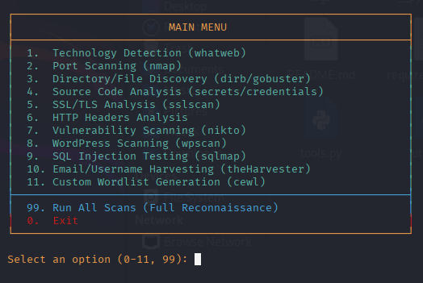

# <div align="center"> 🔍 VulnHawk - Advanced Web Reconnaissance Toolkit </div>

<div align="center">

[](https://python.org)
[](LICENSE)
[](README.md)

**A comprehensive reconnaissance framework for ethical penetration testing and security research**

*Automate your OSINT gathering with 11+ integrated security tools*

---



*VulnHawk's colorful interface with interactive menu system*

</div>

---

## 🎯 Overview

**VulnHawk** is a modular reconnaissance toolkit that streamlines the information gathering phase of penetration testing. Built for cybersecurity professionals, bug bounty hunters, and ethical hackers, it combines multiple industry-standard tools into a unified, easy-to-use interface.

### ✨ Key Highlights

- 🔧 **11+ Integrated Tools** - Nmap, Nikto, SQLMap, WPScan, and more
- 🎨 **Beautiful Interface** - Color-coded output with clear progress indicators
- 📊 **Automated Reporting** - Timestamped logs and structured output
- 🚀 **One-Click Scanning** - Full reconnaissance suite with a single command
- 🛡️ **Ethical Focus** - Built-in safety warnings and responsible disclosure guidelines

---

## 🛠️ Installation

### Prerequisites

- **Operating System**: Kali Linux / Ubuntu / Debian
- **Python**: 3.6 or higher
- **Privileges**: Root access recommended for optimal tool functionality

### Quick Setup

```bash
# Clone the repository
git clone https://github.com/niladri-1/VulnHawk.git
cd VulnHawk

# Make setup script executable and run
sudo chmod +x setup.sh && sudo ./setup.sh

# Install Python dependencies
sudo pip3 install -r requirements.txt

# Launch the tool
sudo python3 main.py
```

### Manual Installation

<details>
<summary>Click to expand manual installation steps</summary>

```bash
# Update system packages
sudo apt update && sudo apt upgrade -y

# Install security tools
sudo apt install -y nmap whatweb dirb gobuster nikto sslscan \
                    wpscan sqlmap theharvester cewl curl dig \
                    whois openssl python3-pip

# Install Python requirements
pip3 install colorama requests beautifulsoup4 urllib3 certifi lxml

# Set permissions
chmod +x main.py
```

</details>

---

## 🚀 Quick Start

### Basic Usage

```bash
# Launch VulnHawk
sudo python3 main.py

# Select target (e.g., example.com)
# Choose scan type from menu (1-11)
# View results in logs/ directory
```

### Example Workflow

1. **🎯 Set Target** - Enter domain or IP address
2. **📋 Choose Scan** - Select from 0-11 reconnaissance modules
3. **⏱️ Monitor Progress** - Watch real-time colored output
4. **📄 Review Results** - Check timestamped logs in `logs/` folder

---

## 🧪 Features & Modules

<table align="center">
<tr>
<td width="50%">

### 🔍 **Information Gathering**
- **Technology Detection** - Web stack fingerprinting
- **Port Scanning** - Network service discovery
- **SSL/TLS Analysis** - Certificate and cipher review
- **HTTP Headers** - Security configuration audit
- **Source Code Analysis** - Credential and secret hunting

</td>
<td width="50%">

### 🎯 **Advanced Scanning**
- **Directory Discovery** - Hidden path enumeration
- **Vulnerability Assessment** - Security flaw identification
- **WordPress Scanning** - CMS-specific testing
- **SQL Injection Testing** - Database security validation
- **Email Harvesting** - Contact information gathering
- **Custom Wordlists** - Target-specific dictionary generation

</td>
</tr>
</table>

### 📊 Detailed Module Breakdown

| Module | Tool Used | Purpose | Timeout |
|--------|-----------|---------|---------|
| 🔧 **Technology Detection** | WhatWeb + Custom | Identify web technologies, frameworks, CMS | 60s |
| 🌐 **Port Scanning** | Nmap | Discover open ports and services | 300s |
| 📁 **Directory Discovery** | Gobuster/Dirb | Find hidden directories and files | 300s |
| 🔍 **Source Analysis** | Custom Scripts | Extract secrets, credentials, comments | 15s |
| 🔒 **SSL/TLS Analysis** | SSLScan/OpenSSL | Analyze certificate and encryption | 120s |
| 📋 **Header Analysis** | Custom Scripts | Security headers assessment | 10s |
| 🐛 **Vulnerability Scan** | Nikto | Web application vulnerability detection | 600s |
| 📝 **WordPress Scan** | WPScan | WordPress-specific security testing | 600s |
| 💉 **SQL Injection** | SQLMap | Database injection vulnerability testing | 300s |
| 📧 **Email Harvesting** | theHarvester | Contact information gathering | 180s |
| 📝 **Wordlist Generation** | CeWL | Custom dictionary creation | 180s |

---

## 📁 Project Structure

```
VulnHawk-tool/
├── 📄 main.py              # Main application interface
├── 🔧 tools.py             # Reconnaissance module implementations
├── 🛠️ utils.py             # Utility functions and helpers
├── ⚙️ setup.sh             # Automated installation script
├── 📋 requirements.txt      # Python package dependencies
├── 📖 README.md            # Project documentation
└── 📂 logs/                # Auto-generated results directory
    ├── 🎯 target_scan_*.txt     # Individual scan results
    ├── 🔍 target_wordlist_*.txt # Generated wordlists
    └── 📊 target_report_*.txt   # Comprehensive reports
```

---

## 💻 Usage Examples

### Single Module Execution

```bash
# Technology fingerprinting only
sudo python3 main.py
> Enter target: example.com
> Select option: 1

# Port scanning with service detection
sudo python3 main.py
> Enter target: 192.168.1.100
> Select option: 2
```

### Full Reconnaissance Suite

```bash
# Complete automated scanning
sudo python3 main.py
> Enter target: target-domain.com
> Select option: 99  # Run all scans
```

---

## 📊 Sample Output

### Technology Detection Results
```
═══════════════════════════════════════════════════════════════
TECHNOLOGY DETECTION (HTTPS) - SUCCESS
═══════════════════════════════════════════════════════════════

Target: example.com
Timestamp: 2024-12-30 14:30:22

Server: nginx/1.18.0
X-Powered-By: PHP/7.4.3
CMS: WordPress 6.1.1
Framework: Bootstrap 4.6.0
CDN: Cloudflare
SSL: TLS 1.3

✓ Output saved to: logs/example.com_technology_detection_20241230_143022.txt
```

### Port Scan Results
```
═══════════════════════════════════════════════════════════════
PORT SCAN RESULTS - SUCCESS
═══════════════════════════════════════════════════════════════

22/tcp   open  ssh     OpenSSH 8.2p1
80/tcp   open  http    nginx 1.18.0
443/tcp  open  https   nginx 1.18.0
3306/tcp open  mysql   MySQL 8.0.25

✓ Output saved to: logs/example.com_port_scan_20241230_143125.txt
```

---

## ⚠️ Security & Legal Notice

<div align="center">

### 🔴 **IMPORTANT DISCLAIMER**

**This tool is for authorized testing only!**

</div>

- ✅ **Authorized Use Only** - Only scan systems you own or have explicit permission to test
- 🚫 **No Unauthorized Scanning** - Unauthorized reconnaissance may violate laws in your jurisdiction
- 📜 **Responsible Disclosure** - Report vulnerabilities through proper channels
- 🛡️ **Educational Purpose** - Designed for learning and improving security

### Best Practices

1. **📝 Get Written Permission** - Always obtain explicit authorization before scanning
2. **⏰ Respect Rate Limits** - Avoid overwhelming target systems
3. **🔒 Secure Your Data** - Protect collected information appropriately
4. **📊 Document Everything** - Maintain detailed logs for compliance

---

## 🤝 Contributing

We welcome contributions! Here's how you can help:

### Development Setup

```bash
# Fork and clone the repository
git clone https://github.com/niladri-1/VulnHawk.git
cd VulnHawk

# Create feature branch
git checkout -b feature/new-module

# Make changes and test
python3 main.py

# Submit pull request
```

### Contribution Guidelines

- 🐛 **Bug Reports** - Use GitHub issues with detailed descriptions
- ✨ **Feature Requests** - Propose new modules or improvements
- 🔧 **Code Contributions** - Follow Python PEP 8 style guidelines
- 📖 **Documentation** - Help improve README and code comments

---

## 🆘 Troubleshooting

### Common Issues

<details>
<summary><strong>Permission Denied Errors</strong></summary>

```bash
# Run with sudo privileges
sudo python3 main.py

# Check file permissions
chmod +x main.py setup.sh
```

</details>

<details>
<summary><strong>Missing Tools</strong></summary>

```bash
# Reinstall tools manually
sudo apt install nmap nikto sqlmap wpscan

# Check tool availability
which nmap
which nikto
```

</details>

<details>
<summary><strong>Python Dependencies</strong></summary>

```bash
# Reinstall requirements
pip3 install -r requirements.txt --force-reinstall

# Check Python version
python3 --version  # Should be 3.6+
```

</details>

### Performance Optimization

- **🚀 SSD Storage** - Use SSD for faster wordlist operations
- **🌐 Network Speed** - Ensure stable internet connection
- **💾 RAM Usage** - Monitor memory during large scans
- **⏱️ Timeouts** - Adjust timeout values in `utils.py` if needed

---

## 📄 License

This project is licensed under the MIT License - see the [LICENSE](LICENSE) file for details.

### Third-Party Tools

This toolkit integrates the following open-source security tools:

- **Nmap** - Network discovery and security auditing
- **Nikto** - Web server scanner
- **SQLMap** - Automatic SQL injection tool
- **WPScan** - WordPress security scanner
- **And more...** - See `setup.sh` for complete list

---

## 📞 Support & Contact

<div align="center">

### Need Help?

[](https://github.com/niladri-1/VulnHawk-tool/issues)
[](README.md)
[](https://discord.gg/yourinvite)

**Made with ❤️ by the cybersecurity community**

</div>

---

<div align="center">

**⭐ Star this repository if you find it useful!**

*VulnHawk - Making reconnaissance accessible for everyone*

</div>