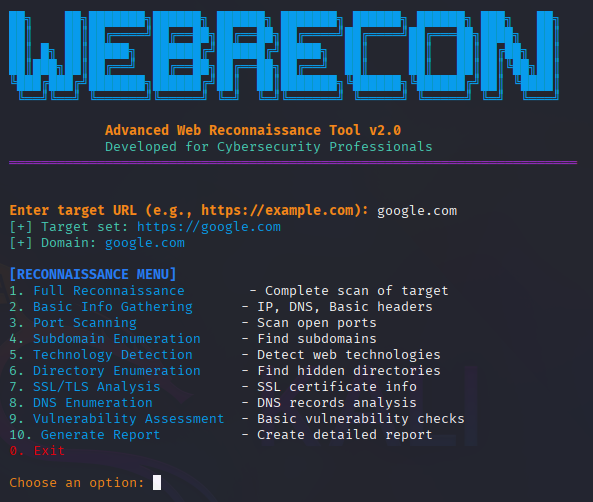

# <div align="center"> WebRecon 🕸️ </div>

<div align="center">


[](https://python.org)
[](https://linux.org)
[](LICENSE)
[](https://github.com/niladri-1/WebRecon/stargazers)

**Advanced Web Reconnaissance Tool for Cybersecurity Professionals**

*Comprehensive web security assessment and information gathering toolkit*

</div>

---

## 🎯 About

WebRecon is a powerful, all-in-one web reconnaissance tool designed for cybersecurity professionals, penetration testers, and security researchers. It automates the process of gathering critical information about web targets, identifying potential vulnerabilities, and generating comprehensive reports.

<div align="center">
  
</div>

---

## ✨ Key Features

<div align="center">

| 🔍 Information Gathering | 🌐 Network Reconnaissance | 💻 Web Analysis | 🛡️ Security Assessment |
|:------------------------:|:-------------------------:|:--------------:|:----------------------:|
| DNS Resolution & Analysis | Port Scanning | Technology Detection | Vulnerability Assessment |
| WHOIS Lookup | Subdomain Enumeration | Directory Enumeration | Security Header Analysis |
| Geolocation Detection | Service Detection | SSL/TLS Certificate Analysis | Information Disclosure Detection |
| HTTP Header Analysis | Network Mapping | CMS Detection | Configuration Analysis |

</div>

### 📊 Advanced Capabilities

**Information Gathering**
- DNS resolution with comprehensive record enumeration
- WHOIS data extraction and analysis
- Geolocation identification with ISP details
- HTTP header extraction and security analysis

**Network Reconnaissance**
- Multi-threaded port scanning for efficiency
- Intelligent subdomain discovery using wordlist techniques
- Service fingerprinting on discovered ports
- Network topology mapping

**Web Application Analysis**
- Advanced technology stack identification
- Hidden directory and file discovery
- SSL/TLS certificate validation and analysis
- CMS and framework detection

**Security Assessment**
- Automated vulnerability scanning
- Security misconfiguration detection
- Missing security header identification
- Information leakage analysis

---

## 🚀 Quick Start

### Prerequisites
```bash
# System Requirements
- Python 3.6+
- Linux/Unix OS
- 512MB RAM minimum
- 100MB disk space
```

### Installation
```bash

# 1. Clone repository
git clone https://github.com/niladri-1/WebRecon.git
cd WebRecon


# 2. Update system packages
sudo apt update && sudo apt install curl dnsutils whois openssl


# 3. Make executable
chmod +x webrecon.py

# 4. Run WebRecon
python3 webrecon.py
```

---

## 🔧 Usage Guide

### Interactive Menu Options

<div align="center">

| Option | Function | Description |
|:------:|:--------:|:------------|
| 1 | Full Reconnaissance | Complete automated security scan |
| 2 | Basic Info Gathering | IP resolution, DNS, and headers |
| 3 | Port Scanning | Network port discovery and analysis |
| 4 | Subdomain Enumeration | Subdomain discovery and mapping |
| 5 | Technology Detection | Web technology stack identification |
| 6 | Directory Enumeration | Hidden resource discovery |
| 7 | SSL/TLS Analysis | Certificate and encryption analysis |
| 8 | DNS Enumeration | Comprehensive DNS record analysis |
| 9 | Vulnerability Assessment | Security weakness identification |
| 10 | Generate Report | Detailed reporting and documentation |

</div>

### Example Usage
```bash
# Run WebRecon
./webrecon.py

# Enter target (supports multiple formats)
Enter target URL: https://example.com
# or
Enter target URL: example.com
# or
Enter target URL: 192.168.1.1
```

---

## 📁 Output Structure

```
results/
└── scan_20241129_143022/
    ├── README.md              # 📄 Comprehensive report
    ├── scan_data.json         # 📊 Raw scan data
    ├── vulnerabilities.json   # 🛡️ Security findings
    └── technologies.json      # 💻 Technology stack
```

---

## 🔍 Core Modules

<div align="center">

| 🔌 Port Scanning Engine | 🌐 Subdomain Discovery | 💻 Technology Detection | 🛡️ Security Analysis |
|:------------------------:|:----------------------:|:-----------------------:|:--------------------:|
| **Common Ports Scanned** | **DNS-Based Enumeration** | **CMS Detection** | **Header Analysis** |
| 21, 22, 23, 25, 53, 80 | Comprehensive wordlists | WordPress, Joomla, Drupal | Security headers validation |
| 443, 993, 995, 3389 | Parallel resolution | Magento, PrestaShop | Missing headers detection |
| 5432, 3306, 8080, 8443 | IP correlation mapping | | |
| | | | |
| **Multi-threaded Performance** | **Geographic Distribution** | **Web Servers** | **SSL/TLS Assessment** |
| Concurrent scanning | Active subdomain verification | Apache, Nginx, IIS | Certificate validation |
| Service identification | DNS record enumeration | LiteSpeed, Caddy | Cipher analysis |
| Version detection | | | Configuration review |
| | | | |
| **Output Format** | **Validation Process** | **Frameworks & Languages** | **Vulnerability Detection** |
| Organized port status | Real-time verification | Laravel, Django, React | Common web vulnerabilities |
| Service mapping | Response code analysis | Angular, Vue.js, PHP | Misconfiguration detection |
| Banner grabbing | Timeout handling | Python, Java, ASP.NET | Information disclosure |
| | | Node.js, Databases | OWASP Top 10 checks |

</div>

---

## 📊 Sample Report Output

# 🕸️ WebRecon Security Assessment Report

**Target**: https://example.com
**Domain**: example.com
**Scan Date**: 2024-11-29 14:30:22
**Duration**: 2m 34s

## 🔍 Target Information
| Property | Value |
|----------|-------|
| **IP Address** | 93.184.216.34 |
| **Location** | Norwell, United States |
| **ISP** | Edgecast |
| **Server** | Apache/2.4.41 |

## 🔓 Network Analysis
| Port | Service | Status | Version |
|------|---------|--------|---------|
| 22   | SSH     | Open   | OpenSSH 8.2 |
| 80   | HTTP    | Open   | Apache 2.4.41 |
| 443  | HTTPS   | Open   | Apache 2.4.41 |

## 💻 Technology Stack
- **CMS**: WordPress 6.3.1
- **Server**: Apache 2.4.41
- **Language**: PHP 8.1
- **Database**: MySQL (detected)

## 🛡️ Security Findings
⚠️ **Medium Risk**: Missing X-Frame-Options header
⚠️ **Low Risk**: Server version disclosure
✅ **Good**: HTTPS properly configured

---

## 🎨 Advanced Features

<div align="center">

### 🎯 Performance Optimizations
Multi-threaded scanning • Concurrent DNS resolution • Efficient resource utilization • Smart timeout handling

### 🔒 Security Focus
Header analysis • SSL validation • Vulnerability identification • Information disclosure detection

### 📈 Comprehensive Reporting
Markdown reports • JSON export • Timestamped results • Structured data output

### 🌈 User Experience
Colorized output • Interactive menus • Progress indicators • Error handling

</div>

---

## ⚠️ Legal & Ethical Use

**IMPORTANT**: This tool is designed for authorized security testing only. Users must:

- ✅ Only test systems you own or have explicit permission to test
- ✅ Comply with applicable laws and regulations
- ✅ Use responsibly for legitimate security research
- ❌ Never use for unauthorized access or malicious purposes

---

## 🤝 Contributing

We welcome contributions! Please follow these guidelines:

### Development Process
1. **Fork** the repository
2. **Create** a feature branch (`git checkout -b feature/amazing-feature`)
3. **Commit** changes (`git commit -m 'Add amazing feature'`)
4. **Push** to branch (`git push origin feature/amazing-feature`)
5. **Open** a Pull Request

### Code Standards
- Follow PEP 8 Python style guidelines
- Add comprehensive comments and docstrings
- Include unit tests for new features
- Update documentation as needed

---

## 📄 License

This project is licensed under the MIT License - see the [LICENSE](LICENSE) file for details.

---

## 🔗 Resources

<div align="center">

[](https://github.com/niladri-1/WebRecon)
[](https://github.com/niladri-1/WebRecon/issues)
[](https://github.com/niladri-1/WebRecon/releases)
[](https://github.com/niladri-1/WebRecon/wiki)

</div>

---

<div align="center">

### ⭐ Support WebRecon

If you find this tool valuable, please consider starring the repository!

[](https://github.com/niladri-1/WebRecon/stargazers)

**Made with ❤️ by [niladri-1](https://github.com/niladri-1)**

</div>